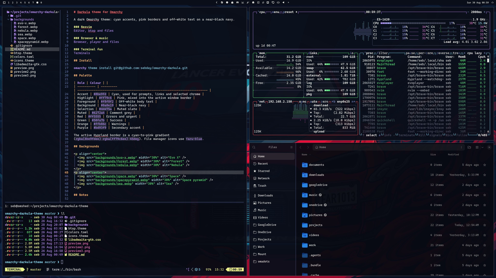
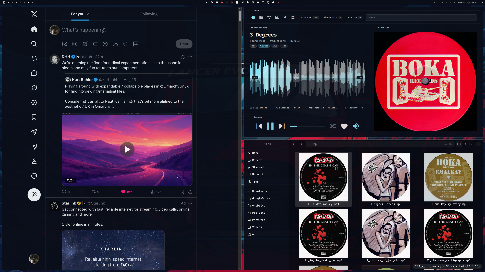
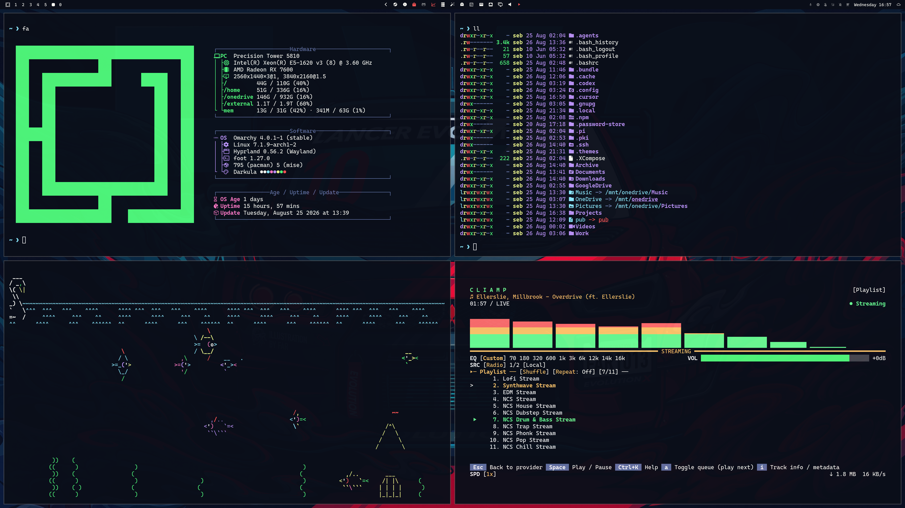
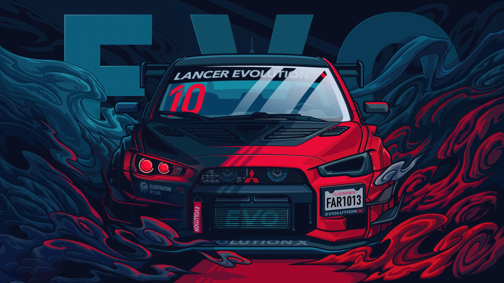
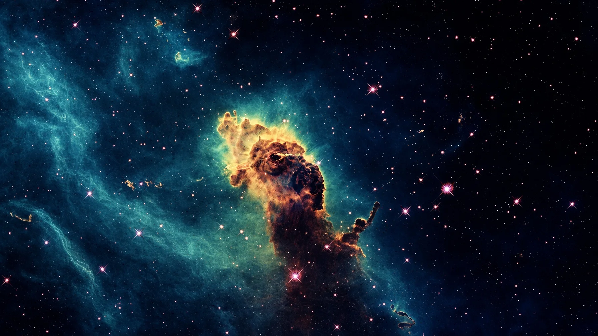
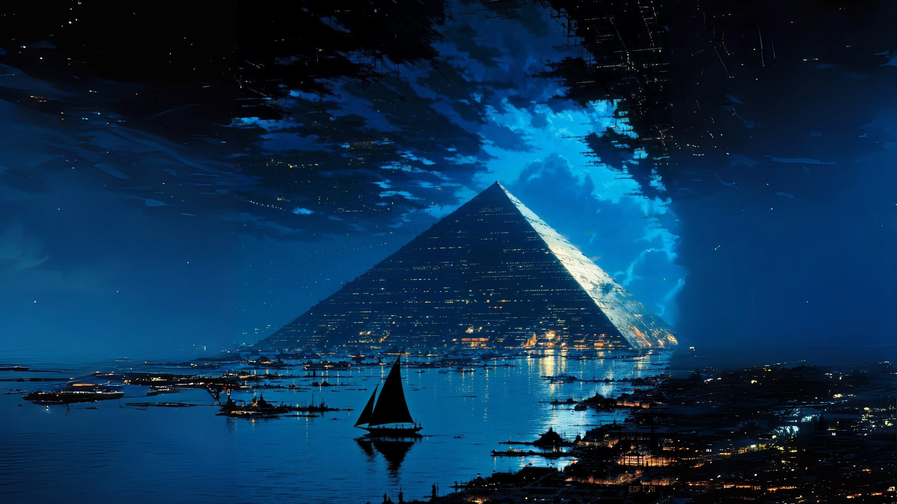

# Darkula theme for Omarchy

A dark Omarchy theme: cyan accents, pink borders and off-white text on a near-black navy.

### Neovim


### Browser & music


### Terminal fun


## Install

```bash
omarchy theme install git@github.com:sebday/omarchy-darkula.git
```

## Palette

| Role | Colour | |
| ---------- | --------- | ------------------------------------------------------------------------ |
| Accent | `#8be9fd` | Cyan, used for prompts, links and selected chrome |
| Highlight | `#ff79c6` | Pink, mixed into the active window border |
| Foreground | `#f8f8f2` | Off-white body text |
| Background | `#0a0e19` | Near-black navy |
| Selection | `#44475a` | Muted slate |
| Muted | `#6272a4` | Comment grey |
| Red | `#ff5555` | Errors and urgent |
| Green | `#50fa7b` | Success |
| Orange | `#ffb86c` | Warnings |
| Purple | `#bd93f9` | Secondary accent |

The active Hyprland border is a cyan-to-pink gradient
(`rgba(8be9fdee) rgba(ff79c6ee) 45deg`). File manager icons use `Yaru-blue`.

## Backgrounds

<p align="center">
  
  
  
</p>
<p align="center">
  
  
  
</p>

## Notes

`colors.toml` is the source of truth. Omarchy generates terminal, VSCode, Chromium, foot etc shell colours from it. `btop.theme`, `icons.theme` and `libadwaita-gtk.css` are checked in so those apps keep the same palette without waiting on templates.

`libadwaita-gtk.css` supplies `@define-color` overrides for GTK4/libadwaita apps such as Nautilus & file dialogs. Stock Omarchy does not deploy GTK4 palette CSS; this file is for a patched install that generates it from `colors.toml` and writes `~/.config/gtk-4.0/gtk.css` on theme switch.

To apply manually after installing the theme:

```bash
mkdir -p ~/.config/gtk-4.0
cp ~/.config/omarchy/themes/darkula/libadwaita-gtk.css ~/.config/gtk-4.0/gtk.css
pkill -USR1 nautilus 2>/dev/null || true
```

Restart any other open GTK4 apps if they do not pick up the change.

## Licence

MIT
